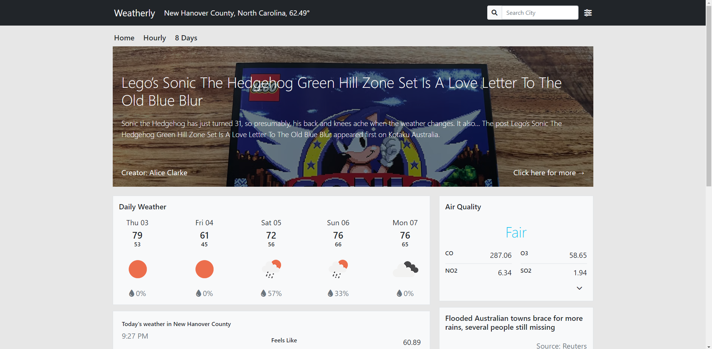
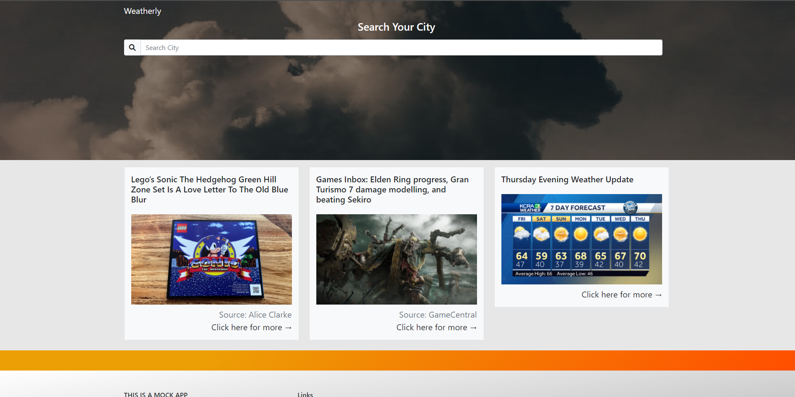
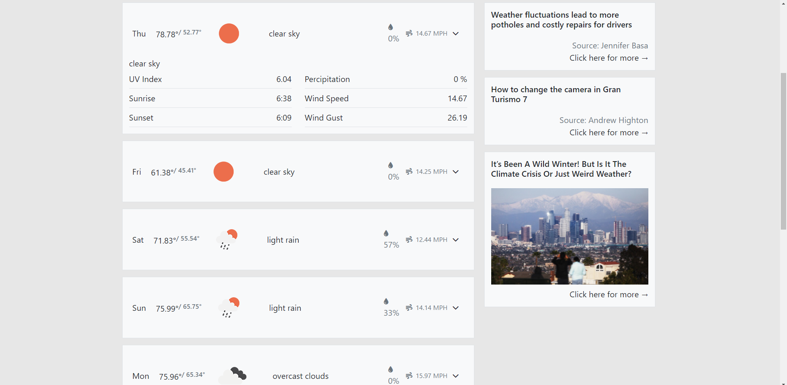
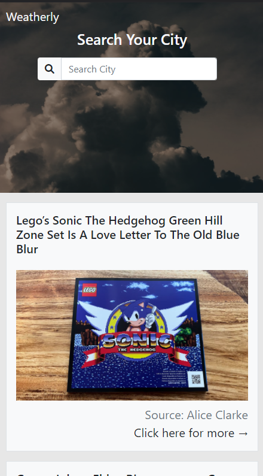
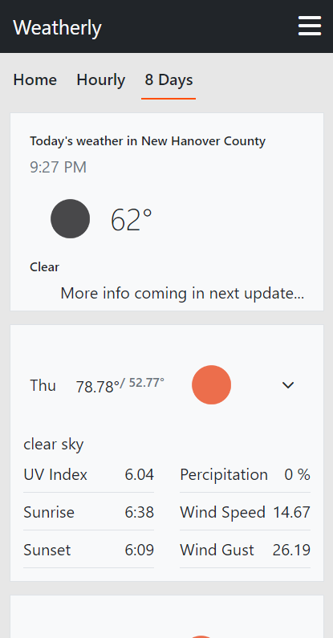

# Weatherly

- An application that uses OpenWeather API, Geolocation API, and a News API to get weather, news data for your location, and display the information in a professional manner.

- This application has a Modern, Responsive design that handles API requests and displays the information with React using React Hooks, React State, and Vanilla JavaScript.

- The Technologies used in the application are BootStrap5, CSS, JavaScript, React, React hooks, React State, and API Calls.

- THIS APPLICATION IS CURRENTLY IN TESTING\*\*

## Screenshots

 
Homepage

 
 
No Weather Selected

 
 
8 Day forecast Page

 
 
Mobile Views

 

  
  
  
 

## Getting Started

Fork and clone this repo / or download, and register api keys from openweather and newsData.io. use them in .env file and name accordingly to keys in the api folder.

## Deployed version

[WeatherlyDeployment](https://obscure-reaches-21818.herokuapp.com/)

## Authors

- Anthony Mclamb

## Version History

-1.0

- Initial Release
- 0.2
  - Various bug fixes and optimizations
  - See commit change or commit history
- 0.1
  - Initial Release

## Acknowledgments

- Credit to OpenWeather for weather data.
- Credit to NewsData.IO for news updates.
